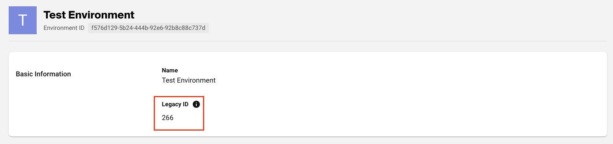
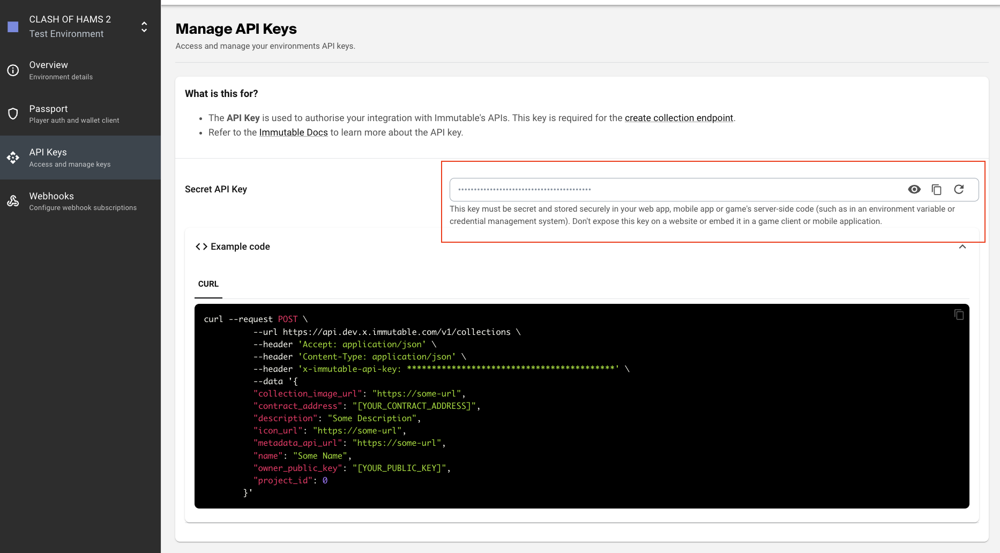

# Onboarding (Self-service)

To begin, clone this repository:

```sh
git clone https://github.com/immutable/imx-examples.git

cd imx-examples
```

Copy environment file

```sh
cp .env.example .env
```

Set the onboarding private key in `.env`. Your private key will be used to create a signed payload only and will not be sent to our backend services.

```sh
OWNER_ACCOUNT_PRIVATE_KEY=YOUR_PRIVATE_KEY
```

Set the `API_KEY` in the `.env` file. You can create and manage your API key in the [Immutable Hub](https://hub.immutable.com/). The Immutable Hub serves as a portal for creating, displaying, and refreshing API keys. Navigate to the "API Keys" menu item within your chosen project and environment to manage or create your API keys.

```sh
API_KEY=YOUR_SECRET_API_KEY
```

Install dependencies

```sh
npm install
```

## 0. Register with your email for the Immutable Developer Hub

Register with your email address at the [Immutable Developer Hub](https://hub.immutable.com) to get access to customized documentation in the hub as well as the ability to create projects on Immutable via the [Public API](https://docs.x.immutable.com/reference#/operations/createProject) or the CLI in this repo.

You must first have a project in order to create collections that you can mint assets from on Immutable (L2).

## 1. Register as a user with Immutable X

We provide an authentication service to protect your administrative level assets from being accessed or updated by someone else. This is done using a simliar technique as described [here](https://link.medium.com/CVTcj7YfQkb).

In order to use services like creating a project or collection, you will first need to register as an Immutable X user. This is done by setting up an account using the private key from the wallet account you would like to specify as the owner of the project.

Run the following script:

_Requires environment variables `OWNER_ACCOUNT_PRIVATE_KEY` to be set._

```sh
npm run onboarding:user-registration
```

## 2. Create project

Follow the guide at [here](https://docs.immutable.com/docs/x/launch-collection/register-project) to create a project in the [Immutable Hub](https://hub.immutable.com).

- Ensure you create a project for the **`Immutable X`** rollup.

## 3. Add a collection

A collection refers to a smart contract you have deployed. Minted assets belong to a collection. In order to mint assets on L2
you must first register your collection (smart contract) with Immutable X.

Add the collection contract address to the environment variable `COLLECTION_CONTRACT_ADDRESS`.

Set `COLLECTION_PROJECT_ID` to the legacy ID in your created environment's overview page from step 2.



Generate an API key in Hub and set the `API_KEY` to the generated value.



Once updated, run the following script to create your collection:

_Requires environment variables `OWNER_ACCOUNT_PRIVATE_KEY`, `COLLECTION_PROJECT_ID`, `API_KEY` and `COLLECTION_CONTRACT_ADDRESS` to be set._

```sh
npm run onboarding:create-collection
```

If you see a `replacement transaction underpriced` error message when trying to run `create-collection` please try again in 5 minutes.

There is a convenience script to get the info of the newly created collection:

```sh
npm run public:get-collection-info
```

The collection should also be visible in the [Immutable Hub](https://hub.immutable.com).

## 4. Add metadata schema to your collection

Update the `4-add-metadata-schema.ts` file with the metadata schema values you want to define. The metadata schema is used to define the structure of the metadata that will be associated with the NFTs in your collection.

Descriptions of the metadata schema fields can be found [here](https://docs.immutable.com/docs/x/launch-collection/register-metadata-schema#metadata-schema).

Once updated, run the following script to create your collection:

_Requires environment variables `OWNER_ACCOUNT_PRIVATE_KEY` and `COLLECTION_CONTRACT_ADDRESS` to be set._

```sh
npm run onboarding:add-metadata-schema
```

If you want to add additional metadata schemas, you can do so by adding more objects to the `metadata` array, and remove any existing metadata schemas from the `metadata` array, and then run the script again.

If you want to change the properties of an existing field, you can use the `updateMetadataSchemaByName` function instead. There is an example of this in the `4-add-metadata-schema.ts` file.

## 5. Mint NFTs

There is an minting example script, `5-mint-nfts.ts`, which is used to mint example NFTs to a wallet.

The default behaviour is to mint the NFTs to the wallet that owns the `OWNER_ACCOUNT_PRIVATE_KEY`. If you want to mint the NFTs to a different wallet, you can uncomment and update the `mintRecipient` value passed to the `mint` function in the script.

Also take a look at the example token objects in `tokens` array and update the blueprint values to your liking.

For a deeper explanation of the blueprint string, see the [Deep dive into metadata section] in the Immutable X documentation(https://docs.immutable.com/docs/x/deep-dive-metadata#providing-a-blueprint-string-when-token-is-minted-on-l2).

_Requires environment variables `OWNER_ACCOUNT_PRIVATE_KEY` and `COLLECTION_CONTRACT_ADDRESS` to be set._

```sh
npm run onboarding:mint
```

Once the NFTs have been minted, you can run the following script to get the info of the minted NFTs in the collection:

```sh
npm run public:get-assets-info
```
